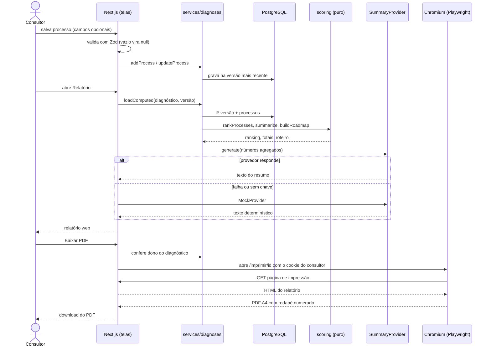

# Sequência: do cadastro ao relatório em PDF

```mermaid
sequenceDiagram
    actor C as Consultor
    participant UI as Next.js (telas)
    participant S as services/diagnoses
    participant DB as PostgreSQL
    participant E as scoring (puro)
    participant P as SummaryProvider
    participant PW as Chromium (Playwright)

    C->>UI: salva processo (campos opcionais)
    UI->>UI: valida com Zod (vazio vira null)
    UI->>S: addProcess / updateProcess
    S->>DB: grava na versão mais recente
    C->>UI: abre Relatório
    UI->>S: loadComputed(diagnóstico, versão)
    S->>DB: lê versão + processos
    S->>E: rankProcesses, summarize, buildRoadmap
    E-->>S: ranking, totais, roteiro
    UI->>P: generate(números agregados)
    alt provedor responde
        P-->>UI: texto do resumo
    else falha ou sem chave
        UI->>P: MockProvider
        P-->>UI: texto determinístico
    end
    UI-->>C: relatório web
    C->>UI: Baixar PDF
    UI->>S: confere dono do diagnóstico
    UI->>PW: abre /imprimir/id com o cookie do consultor
    PW->>UI: GET página de impressão
    UI-->>PW: HTML do relatório
    PW-->>UI: PDF A4 com rodapé numerado
    UI-->>C: download do PDF
```
